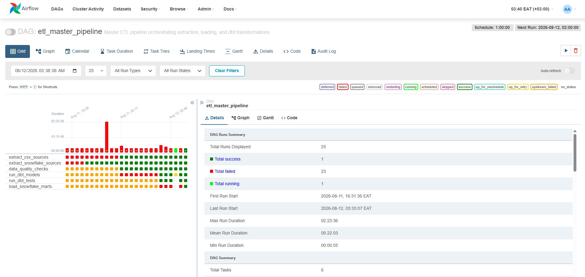

# End-to-End Data Engineering Pipeline

> Production-grade ETL/ELT system built with **Apache Airflow**, **Apache Spark**, **dbt**, and **Snowflake** — designed, tested, and optimized to run on a standard 16GB RAM laptop.

---

## What This Project Does

This is a **complete data platform** that ingests raw sales, customer, and product data from multiple sources, cleans and transforms it, and delivers analytics-ready datasets for business reporting.

**Business outcome:** Stakeholders get reliable, up-to-date answers to questions like:
- What is our daily revenue by country and product category?
- Which customer segments are active, at-risk, or churned?
- What is the profit margin on every sale?

---

## The Problem It Solves

Most data engineering tutorials stop at "hello world." This project solves the **real-world challenge** of building a pipeline that:

1. **Connects to live data sources** — CSV exports from POS systems, Snowflake data warehouses, and REST APIs
2. **Handles data quality** — null checks, uniqueness constraints, schema validation
3. **Scales with data size** — switches between Pandas (small data) and PySpark (large data) without rewriting logic
4. **Runs on modest hardware** — the entire stack (Airflow + Spark + PostgreSQL + Redis) fits comfortably on a 16GB laptop
5. **Recovers from failure** — automatic retries with exponential backoff, structured logging, and monitoring

---

## Architecture & Tech Stack

| Layer | Technology | Purpose |
|-------|-----------|---------|
| **Orchestration** | Apache Airflow (CeleryExecutor) | Schedules and monitors pipeline runs hourly |
| **Distributed Processing** | Apache Spark (local + Docker cluster) | Handles medium-to-large datasets (1–50GB) |
| **Transformations** | dbt (data build tool) | SQL-based staging → intermediate → mart models |
| **Data Warehouse** | Snowflake | Cloud source and destination for analytics |
| **Staging Database** | PostgreSQL | Local landing zone for raw and transformed data |
| **Message Broker** | Redis | Celery task queue for Airflow workers |
| **Containerization** | Docker Compose | Reproducible environment with resource limits |
| **Code Quality** | pre-commit, pytest, GitHub Actions | CI/CD with unit, integration, and Spark tests |

---

## Key Features Demonstrated

### Multi-Source Data Ingestion
- **CSV Extractor** — Reads and validates local sales transaction files
- **Snowflake Extractor** — Connects via password or key-pair authentication, pulls incremental event data
- **API Extractor** — Fetches data from REST endpoints with retry logic and timeout handling

### Intelligent Processing Engine
- **Auto-scaling**: Pandas for <1GB datasets, PySpark for 1–50GB datasets
- **Spark tuning**: 4GB driver, 4GB executor, 8 shuffle partitions — optimized for laptop hardware
- **Data cleaning**: Deduplication, null handling, string normalization, type casting

### dbt Data Modeling (Medallion Architecture)
```
raw data
    ↓
staging (views)       — stg_sales, stg_customers, stg_products
    ↓
intermediate (tables) — int_sales_enriched (joins + calculated fields)
    ↓
marts (tables)        — fct_sales, dim_customers, dim_products, fct_daily_revenue
```

**Analytics outputs:**
- `fct_sales` — Incremental fact table with profit per transaction
- `dim_customers` — Customer dimension with lifetime value, order count, and churn segmentation (Active / At Risk / Churned / Never Purchased)
- `fct_daily_revenue` — Daily aggregations by country and category

### Production Reliability
- **Data quality gates** — Custom validators + dbt tests (uniqueness, not-null, positive revenue)
- **Retry logic** — Exponential backoff via `tenacity`
- **Structured logging** — JSON logs via `structlog` for observability
- **Snapshots** — Slowly Changing Dimensions (SCD) for customer and product history

---

## Pipeline Orchestration (Airflow DAGs)

### 1. `etl_master_pipeline` — Pandas-Based ETL
Runs every hour:
1. Extract CSV sources → PostgreSQL staging
2. Extract Snowflake data → PostgreSQL staging
3. Run data quality checks
4. Execute dbt models
5. Run dbt tests
6. Load results to Snowflake marts


*Airflow Grid view showing 25+ DAG runs with task-level success/failure tracking*

### 2. `spark_etl_pipeline` — Spark-Based ETL
Runs every hour for larger datasets:
1. Validate input files
2. Submit Spark job: CSV → PostgreSQL
3. Submit Spark job: Snowflake → PostgreSQL
4. Run dbt models
5. Run dbt tests

.jpg)
*Airflow Graph view showing the full Spark ETL DAG with all 5 tasks completing successfully*

### 3. `dbt_daily_transformations` — Daily Batch
1. Install dbt dependencies
2. Load seed data (e.g., country codes)
3. Run all models
4. Execute tests
5. Generate documentation
6. Run snapshots

### Live Monitoring
Track pipeline health from the command line or Airflow UI:

.jpg)
*Terminal output showing `airflow dags list-runs` for `etl_master_pipeline` — verifying execution state, start/end times, and run IDs*

---

## Project Structure

```
├── airflow/
│   ├── dags/
│   │   ├── etl_pipeline_dag.py      # Pandas-based ETL orchestration
│   │   ├── spark_etl_dag.py         # Spark-based ETL orchestration
│   │   └── dbt_daily_dag.py         # Daily dbt batch job
│   ├── plugins/
│   └── config/
├── dbt/
│   ├── models/
│   │   ├── staging/                 # Cleaned source views
│   │   ├── intermediate/            # Joined and enriched tables
│   │   └── marts/                   # Business-ready fact & dimension tables
│   ├── tests/                       # Custom SQL data quality tests
│   ├── macros/                      # Reusable SQL macros
│   ├── snapshots/                   # SCD Type 2 tracking
│   └── seeds/                       # Static reference data
├── spark/
│   ├── jobs/                        # PySpark scripts for production runs
│   └── config/                      # Spark defaults tuned for 16GB RAM
├── src/data_engineering/
│   ├── extractors/                  # CSV, API, Snowflake extractors
│   ├── transformers/                # Cleaning and normalization
│   ├── loaders/                     # PostgreSQL and Snowflake loaders
│   ├── spark/                       # PySpark extractors, transformers, loaders
│   ├── pipelines/                   # Composable ETL pipeline builder
│   ├── integrations/                # dbt runner, Airflow utilities
│   └── utils/                       # Data validators
├── tests/
│   ├── unit/                        # Component-level tests
│   └── integration/                 # End-to-end pipeline tests
├── docker-compose.yml               # Full stack with resource limits
├── Makefile                         # One-command operations
└── pyproject.toml                   # Python dependencies & tooling
```

---

## Running the Project

### Option 1: Local Python (Lightest — ~4GB RAM)
```bash
# Install dependencies
make install-dev

# Run a Spark job locally
python -m spark.jobs.process_sales

# Run tests
make test
```

### Option 2: Docker Spark Only (Medium — ~8GB RAM)
```bash
# Start Spark master + worker
make spark-up

# Submit a job
make spark-submit JOB=spark/jobs/process_sales.py

# Open PySpark shell
make spark-shell
```

### Option 3: Full Stack (Heavy — ~12–14GB RAM)
```bash
# Start everything: Airflow + Spark + PostgreSQL + Redis
make up

# Access services:
# Airflow UI:  http://localhost:8080
# Spark UI:    http://localhost:8081
# pgAdmin:     http://localhost:5050

# Stop everything
make down
```

---

## Hardware Optimization

This project is intentionally tuned for **16GB RAM / 100GB SSD laptops**:

| Service | Memory | Purpose |
|---------|--------|---------|
| Spark Driver | 4GB | Job coordination |
| Spark Executor | 4GB | Parallel data processing |
| Airflow (all) | ~4GB | Webserver + Scheduler + Worker |
| PostgreSQL | 1GB | Metadata + staging data |
| Redis | 512MB | Celery broker |
| OS + Buffer | ~2.5GB | System headroom |
| **Total** | **~16GB** | Comfortable fit |

**Spark tuning highlights:**
- Adaptive Query Execution (AQE) enabled for runtime optimization
- Shuffle partitions set to 8 (reduces small-file overhead)
- Local temp directory on SSD for spill-to-disk

---

## Testing Strategy

```bash
# Unit tests only
pytest -m unit

# Integration tests
pytest -m integration

# Spark-specific tests
pytest -m spark

# Snowflake-specific tests
pytest -m snowflake

# All tests with coverage
pytest
```

Includes:
- **Unit tests** for extractors, transformers, and loaders
- **Integration tests** for end-to-end pipeline execution
- **dbt tests** for schema constraints and business logic
- **Data quality checks** for null thresholds and value ranges

---

## CI/CD

- **GitHub Actions** workflow runs the full test matrix on every push
- **pre-commit hooks** enforce code formatting, linting, and type checking
- **Docker images** built and tagged for reproducible deployments

---

## Engineering Competencies

This project reflects how I approach data infrastructure — with an emphasis on reliability, observability, and pragmatic trade-offs.

**Pipeline Orchestration**
Designed and productionized a multi-DAG Airflow system using CeleryExecutor, with task dependency graphs, cross-task communication via XCom, and automatic retry policies with exponential backoff. The system runs both scheduled and manual triggers with full execution history.

**Distributed Data Processing**
Architected a dual-mode processing layer: Pandas for rapid iteration on smaller datasets, PySpark for horizontal scaling when data grows. Spark jobs are containerized and configurable across local and cluster deployments, with memory tuning and AQE enabled for efficient query planning.

**Analytics Engineering (dbt)**
Modeled data using the medallion architecture — staging views for source isolation, intermediate tables for business logic and enrichment, and incremental marts for downstream consumption. Implemented SCD snapshots, custom macros, and comprehensive test coverage including uniqueness, referential integrity, and business-rule validations.

**Data Quality & Observability**
Built data quality gates at multiple layers: runtime null-check validators in Python, dbt schema and custom SQL tests, and structured JSON logging via structlog for traceability. Every pipeline run leaves an audit trail.

**Cloud & Security**
Integrated Snowflake as both a source and destination, supporting password and key-pair authentication with environment-based credential management. No secrets are hardcoded; all connections are configurable via env vars or constructor injection.

**Infrastructure & DevOps**
Containerized the full stack with Docker Compose, including resource limits tuned for 16GB RAM. Set up CI/CD with GitHub Actions, pre-commit hooks for linting and formatting, and a Makefile for one-command local development.

**Python Software Engineering**
Wrote production-grade Python with abstract base classes, context managers, generic type hints, and composable pipeline builders. The codebase is modular, testable, and extensible — new extractors or loaders can be added without touching existing logic.

---

## Tech Keywords

`Apache Airflow` · `Apache Spark` · `PySpark` · `dbt` · `Snowflake` · `PostgreSQL` · `Redis` · `Docker` · `Docker Compose` · `Python` · `Pandas` · `SQL` · `ETL` · `ELT` · `Data Modeling` · `Data Quality` · `CI/CD` · `GitHub Actions`
